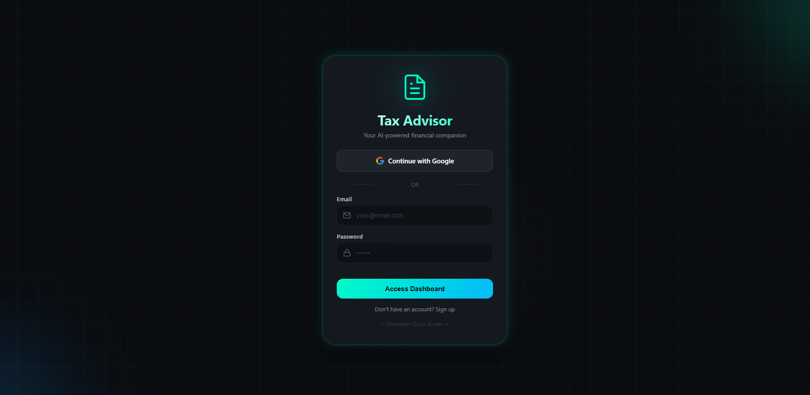
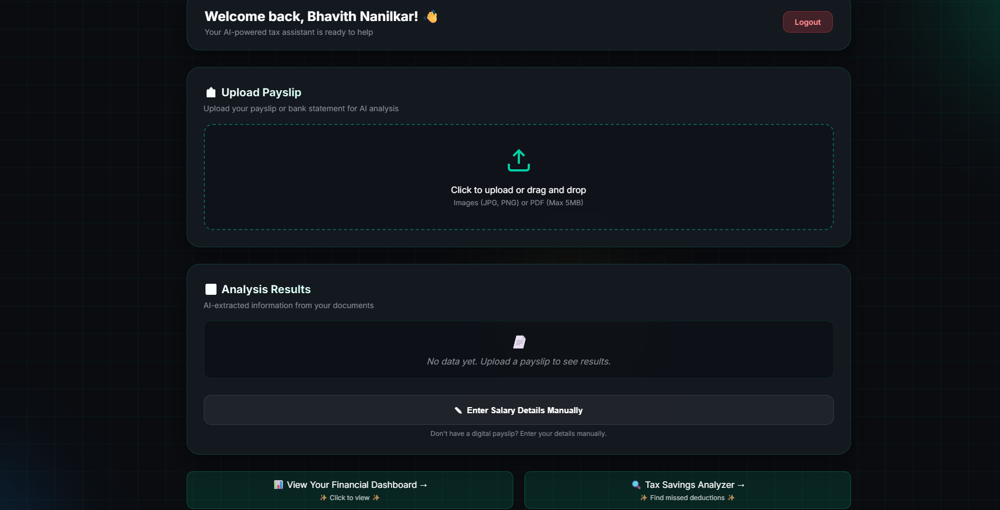
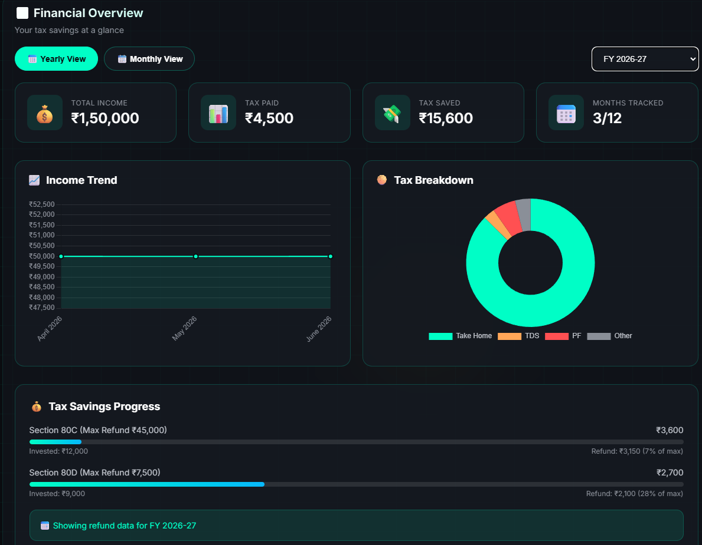
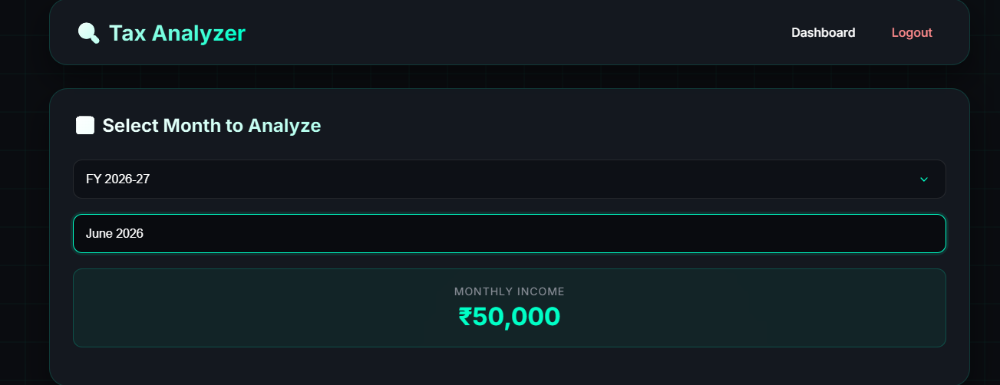
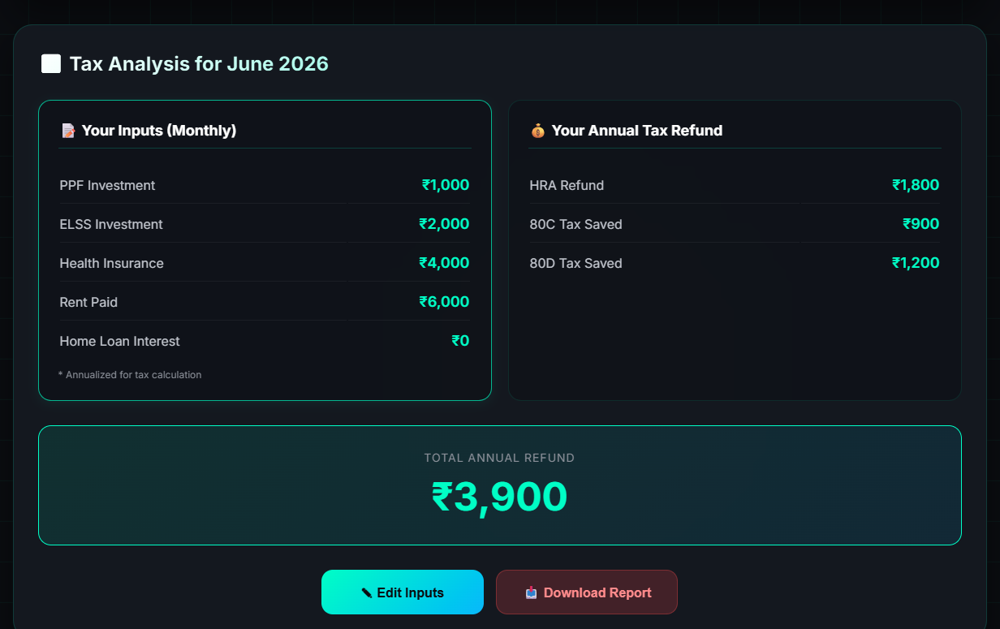
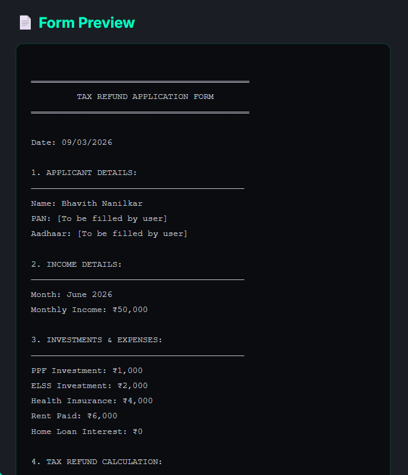

# 🧾 Tax Advisor Assistant

An AI-powered tax advisory application that helps users analyze payslips, calculate tax refunds, and track tax savings across financial years. Built with Flask and integrated with Google Gemini AI for intelligent tax assistance.

🌐 **Live Demo**: [https://tax-advisor-assistant.onrender.com](https://tax-advisor-assistant.onrender.com)

---

## 📸 Screenshots

### 🔐 Login Page

*Secure authentication with Google OAuth*

### 📊 Main Dashboard

*Overview of income, tax paid, and tax saved*

### 💰 Financial Overview

*Tax savings progress bars for 80C and 80D*

### 🔍 Tax Analyzer

*Select financial year and month for analysis*

### ✅ Tax Calculation Results

*Annual refund calculation with HRA, 80C, 80D*

### 📄 Downloadable Form


*Generate and download tax refund application form*

---

## ✨ Features

### 📊 **Financial Dashboard**
- Track income, tax paid, and tax saved across months
- View data by **financial year** (e.g., 2025-26, 2026-27)
- Interactive charts for income trends and tax breakdown
- Progress bars for Section 80C and 80D tax savings

### 🔍 **Tax Analyzer**
- Select months grouped by financial year
- Enter investments (PPF, ELSS, Health Insurance, Rent, Home Loan)
- Calculate **annual tax refund** based on:
  - Section 80C deductions (PPF + ELSS)
  - Section 80D health insurance
  - HRA exemption (annualized calculation)
- Download formatted tax refund application form


### 📤 **Payslip Upload**
- Upload images or PDFs of payslips
- OCR.space integration for text extraction
- Auto-fill income, deductions, and employer details

### 🔐 **Authentication**
- Email/password signup and login
- Google OAuth integration
- Session management

---

## 🛠️ Tech Stack

| Component | Technology |
|-----------|------------|
| Backend | Python, Flask |
| Database | PostgreSQL (Render) / SQLite (local) |
| Frontend | HTML5, CSS3, JavaScript |
| Charts | Chart.js |
| OCR | OCR.space API |
| Authentication | Authlib, Google OAuth |
| Deployment | Render |

---

## 📂 Project Structure

```bash
tax-advisor-assistant/
├── __pycache__/
├── screenshots/
│   ├── screenshot-login.png
│   ├── screenshot-dashboard.png
│   ├── screenshot-financial.png
│   ├── screenshot-analyzer.png
│   ├── screenshot-results.png
│   └── screenshot-form.png
├── static/
│   ├── css/
│   │   ├── dashboard.css
│   │   ├── style.css
│   │   └── tax-bot.css
│   └── js/
│       ├── dashboard-stats.js
│       ├── dashboard.js
│       ├── login.js
│       ├── tax-bot.js
│       └── upload.js
├── templates/
│   ├── dashboard.html
│   ├── login.html
│   ├── signup.html
│   ├── tax-analyzer.html
│   └── tax-bot.html
├── .env
├── .gitignore
├── app.py
├── database.json
├── database.py
├── requirements.txt
└── README.md
```
---

## 🚀 Live Demo

Visit the live application at: https://tax-advisor-assistant.onrender.com

Quick Test: Click "Developer Quick Access" on the login page for instant access.

---


## 📦 Installation

### Prerequisites
Python 3.8+

Git

OCR.space API key (free)

Google OAuth credentials

---

## Local Setup

### Clone the repository

```bash
git clone https://github.com/neutromax/tax-advisor-assistant.git
cd tax-advisor-assistant
```

### Create virtual environment

```bash
python -m venv venv
source venv/bin/activate  # On Windows: venv\Scripts\activate
```

### Install dependencies

```bash
pip install -r requirements.txt
```

### Create .env file

```bash

OCR_SPACE_API_KEY=your-ocr-space-key
GOOGLE_CLIENT_ID=your-google-client-id
GOOGLE_CLIENT_SECRET=your-google-client-secret

```

### Run the app

```bash
python app.py
Open http://localhost:5000 in your browser.
```

---

## 🌐 Deployment (Render)

### 1. Push code to GitHub

```bash

git push origin main
```

### 2. On Render.com:

```bash
 - New Web Service → Connect GitHub repo
 - Build Command: pip install -r requirements.txt
 - Start Command: gunicorn app:app
```

### 3. Add environment variables in Render dashboard

```bash
#    - DATABASE_URL (from PostgreSQL)
#    - SECRET_KEY, OCR_SPACE_API_KEY, etc.

```

---

## 📊 Tax Calculation Logic


### Section 80C

```bash
Investment Limit: ₹1,50,000
Refund: 30% of invested amount
Max Refund: ₹45,000
```


### Section 80D

```bash
Investment Limit: ₹25,000
Refund: 30% of premium
Max Refund: ₹7,500
```

### HRA Exemption

```bash
Annual Rent = Monthly Rent × 12
Exemption = Min of:
  1. Actual Rent Paid - 10% of Salary
  2. 40% of Salary (non-metro) / 50% (metro)
  3. Actual HRA Received
Refund = 30% of Exemption
```

---

## 📧 Contact
Bhavith Nanilkar

GitHub: @neutromax

Project: https://github.com/neutromax/tax-advisor-assistant

Live App: https://tax-advisor-assistant.onrender.com

---


## 🙏 Acknowledgements

Google Gemini AI

OCR.space

Chart.js

Flask

Render

Authlib

---

Made with ❤️ for Indian Taxpayers
